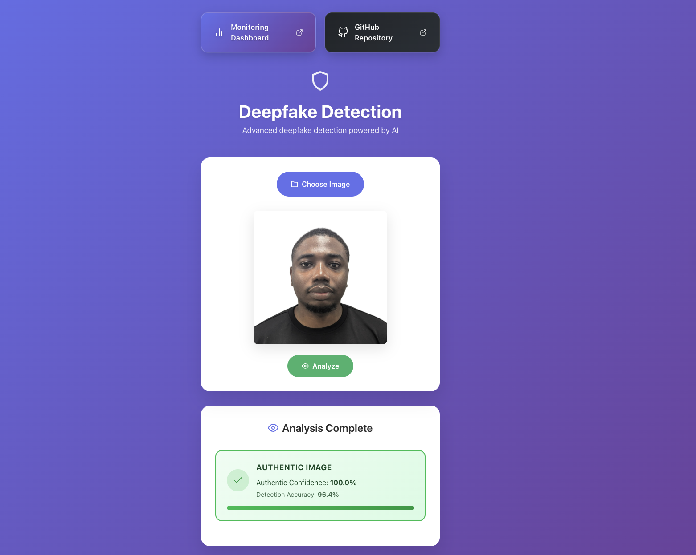
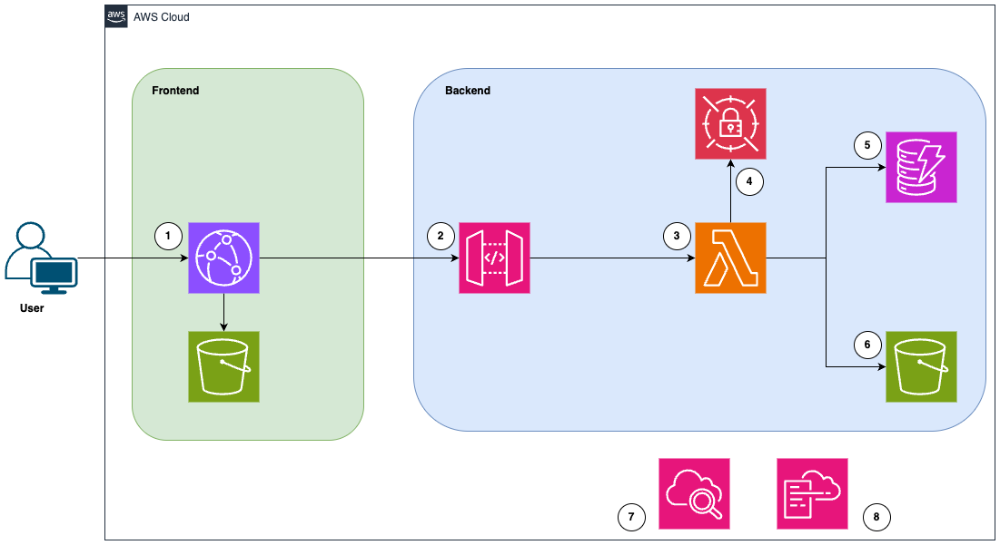

# DeepFake Detection System

> A production-ready, serverless web application for detecting deepfake images using NVIDIA's AI detection API. Built with React and AWS cloud infrastructure.

[](https://aws.amazon.com)
[](https://reactjs.org)
[](https://www.python.org)
[](https://aws.amazon.com/cdk)
[](LICENSE)

## Table of Contents

- [Overview](#overview)
- [Features](#features)
- [Architecture](#architecture)
- [Tech Stack](#tech-stack)
- [Getting Started](#getting-started)
- [Deployment](#deployment)
- [Monitoring](#monitoring)
- [Testing](#testing)
- [Project Structure](#project-structure)
- [Requirements](#requirements)
- [Troubleshooting](#troubleshooting)
- [Contributing](#contributing)
- [License](#license)

## Overview

The DeepFake Detection System is an enterprise-grade application that leverages NVIDIA's state-of-the-art AI detection API to identify artificially generated images. The system provides real-time analysis with confidence scores, bounding box information, and comprehensive monitoring capabilities.



### Key Capabilities

- **Real-time Detection**: Instant analysis of uploaded images with high accuracy
- **Confidence Scoring**: Detailed probability scores for authentic vs. deepfake classification
- **Bounding Box Visualization**: Precise identification of detected regions
- **Scalable Infrastructure**: Serverless architecture that automatically scales with demand
- **Production Monitoring**: Built-in CloudWatch dashboard for real-time observability

## Features

### Core Functionality

- **AI-Powered Detection**: Utilizes NVIDIA's advanced deepfake detection model
- **Real-time Analytics**: Instant results with confidence percentages
- **Visual Feedback**: Color-coded results (green for authentic, red for deepfake)
- **Performance Metrics**: Detailed detection accuracy and bounding box confidence

### Infrastructure Features

- **Serverless Architecture**: Zero infrastructure management overhead
- **Global CDN**: CloudFront distribution for worldwide low-latency access
- **Enterprise Security**: End-to-end encryption, IAM roles, and secrets management
- **Comprehensive Monitoring**: CloudWatch dashboards with Lambda and API Gateway metrics
- **Cost Optimized**: Pay-per-use pricing with automatic scaling to zero
- **Automated Deployment**: One-click deployment with error handling and rollback capability

## Architecture

The application implements a modern serverless microservices architecture on AWS, designed for scalability, reliability, and operational excellence.



### Architecture Overview

The system follows a serverless microservices pattern with the following request flow:

1. **User → CloudFront/S3**: User opens the React app via CloudFront, which serves static content from an S3 bucket.

2. **Frontend → API Gateway**: The frontend sends an image-analysis request to the REST API in API Gateway.

3. **API Gateway → Lambda**: API Gateway invokes the Lambda function, which processes the uploaded image and sends it to the downstream NVIDIA Deepfake Detection API for inference.

4. **Lambda → Secrets Manager**: Lambda retrieves the NVIDIA API key (and other secrets) from Secrets Manager.

5. **Lambda → DynamoDB**: Lambda stores the deepfake detection results and metadata in DynamoDB.

6. **Lambda → S3 (backend)**: Lambda saves the uploaded image (and any derived artifacts) into the backend S3 bucket.

7. **CloudWatch Metrics**: CloudWatch collects metrics and dashboards for Lambda, API Gateway, and other components.

8. **CloudWatch Logs/Tracing**: CloudWatch (and X-Ray/logs) capture detailed logs and traces for debugging and observability.

### Architecture Components

#### Frontend Layer

| Component | Technology | Purpose |
|-----------|------------|---------|
| **UI Framework** | React 18+ | Modern, component-based user interface |
| **Build Tool** | Vite | Fast development and optimized production builds |
| **CDN** | CloudFront | Global content delivery with edge caching |
| **Hosting** | S3 | Static website hosting with high availability |

#### API Layer

| Component | Technology | Purpose |
|-----------|------------|---------|
| **API Gateway** | AWS API Gateway | RESTful API with request routing and throttling |
| **Compute** | AWS Lambda | Serverless functions for image processing |
| **Runtime** | Python 3.12 | High-performance image processing and API integration |

#### Storage Layer

| Component | Technology | Purpose |
|-----------|------------|---------|
| **Object Storage** | Amazon S3 | Secure image storage with encryption at rest |
| **Database** | Amazon DynamoDB | NoSQL database for detection results and metadata |
| **Secrets** | AWS Secrets Manager | Encrypted storage for API keys and credentials |

#### Observability Layer

| Component | Technology | Purpose |
|-----------|------------|---------|
| **Dashboard** | CloudWatch Dashboards | Real-time metrics visualization |
| **Logging** | CloudWatch Logs | Centralized logging with retention policies |
| **Tracing** | AWS X-Ray | Distributed tracing for performance analysis |

#### Security Features

- **Encryption**: Data encrypted at rest (S3, DynamoDB) and in transit (HTTPS/TLS)
- **Access Control**: IAM roles with least-privilege principles
- **Secrets Management**: API keys stored in AWS Secrets Manager with automatic rotation support
- **Network Security**: VPC-ready architecture for enhanced network isolation


## Getting Started

### Prerequisites

Before you begin, ensure you have the following installed:

- **AWS CLI** configured with appropriate credentials
- **Node.js** 18 or higher
- **Python** 3.12 or higher
- **AWS CDK** v2 installed globally (`npm install -g aws-cdk`)
- **NVIDIA API Key** from [NVIDIA API Catalog](https://build.nvidia.com/hive/deepfake-image-detection)

### Installation Steps

1. **Clone the repository**

   ```bash
   git clone <repository-url>
   cd DeepFake
   ```

2. **Obtain NVIDIA API Key**

   Visit the [NVIDIA API Catalog](https://build.nvidia.com/hive/deepfake-image-detection?snippet_tab=Python) to generate your API key.

3. **Configure API Key**

   Create a `.env` file in the root directory:

   ```bash
   api-key = "nvapi-your-key-here"
   ```

4. **Install Dependencies**

   ```bash
   # Install Python dependencies (if using uv)
   uv sync
   
   # Install frontend dependencies
   cd frontend
   npm install
   cd ..
   ```

5. **Deploy Infrastructure**

   ```bash
   ./deploy.sh
   ```

   The deployment script will:
   - Deploy all AWS infrastructure stacks
   - Build and deploy the frontend application
   - Configure CloudFront distribution
   - Create CloudWatch monitoring dashboard

6. **Access the Application**

   After deployment, the CloudFront URL will be displayed in the output. The application will be accessible at:

   ```
   https://<cloudfront-distribution-id>.cloudfront.net
   ```

### Local Development

To run the frontend locally for development:

```bash
cd frontend
npm install
npm run dev
```

The frontend will be available at `http://localhost:5173` (or the port specified by Vite).

## Deployment

### Automated Deployment

The `deploy.sh` script provides a fully automated deployment process with comprehensive error handling:

```bash
./deploy.sh
```

#### Deployment Process

1. **Infrastructure Deployment**
   - S3 Stack (Image storage bucket)
   - DynamoDB Stack (Results database)
   - Secrets Stack (API key management)
   - Lambda Stack (Serverless functions)
   - API Gateway Stack (REST API endpoints)
   - Dashboard Stack (CloudWatch monitoring)

2. **Frontend Build**
   - Dependency installation
   - Production build optimization
   - Environment variable configuration

3. **Frontend Deployment**
   - S3 bucket upload
   - CloudFront distribution update
   - CDN cache invalidation

4. **Verification**
   - Error checking at each stage
   - Deployment output logging
   - Rollback on failure

### Manual Deployment

For more control, you can deploy stacks individually:

```bash
# Deploy infrastructure stacks
cdk deploy S3Stack DynamoDBStack SecretsStack LambdaStack ApiGatewayStack DashboardStack

# Build frontend
cd frontend && npm run build && cd ..

# Deploy frontend stack
cdk deploy FrontendStack
```

## Monitoring

### CloudWatch Dashboard

The application includes a comprehensive CloudWatch dashboard accessible through:

1. **AWS Console**: Navigate to CloudWatch → Dashboards → DeepFake-Monitoring-Dashboard
2. **Frontend Banner**: Click the "Monitoring Dashboard" banner in the application UI

### Metrics Tracked

#### Lambda Metrics

- **Invocations**: Total number of function executions
- **Errors**: Failed invocations and error rate
- **Duration**: Average execution time
- **Throttles**: Rate limiting events

#### API Gateway Metrics

- **Request Count**: Total API requests
- **4XX Errors**: Client-side errors (bad requests, unauthorized, etc.)
- **5XX Errors**: Server-side errors
- **Latency**: Request processing time (p50, p95, p99)

### Log Analysis

Access logs through CloudWatch Logs:

- **Upload Lambda**: `/aws/lambda/deepfake_upload_lambda_function`
- **Dashboard Lambda**: `/aws/lambda/deepfake_dashboard_lambda_function`

Logs include:
- Request/response details
- Error stack traces
- Performance metrics
- API call traces

## Testing

### Manual Testing

1. **Test Image Upload**
   - Navigate to the application
   - Upload an image file
   - Verify detection results display correctly

2. **Test Dashboard Endpoint**
   ```bash
   curl https://your-api-endpoint.com/prod/dashboard
   ```

3. **Verify Monitoring**
   - Check CloudWatch dashboard for metrics
   - Review CloudWatch logs for errors

## Project Structure

```
DeepFake/
├── frontend/                 # React frontend application
│   ├── src/                 # Source code
│   │   ├── App.jsx         # Main application component
│   │   ├── App.css         # Application styles
│   │   └── components/     # Reusable components
│   ├── public/             # Static assets
│   ├── dist/               # Production build (generated)
│   ├── package.json        # Node.js dependencies
│   └── vite.config.js      # Vite configuration
├── lambda/                  # AWS Lambda functions
│   ├── upload.py           # Image upload handler
│   └── dashboard.py        # Dashboard info endpoint
├── stacks/                  # AWS CDK infrastructure stacks
│   ├── lambda_stack.py     # Lambda function definitions
│   ├── apigateway_satck.py # API Gateway configuration
│   ├── frontend_stack.py   # Frontend deployment stack
│   ├── s3_stack.py         # S3 bucket definitions
│   ├── dynamodb_stack.py   # DynamoDB table definitions
│   ├── secrets_stack.py    # Secrets Manager configuration
│   └── dashboard_stack.py  # CloudWatch dashboard
├── layers/                  # Lambda layers
│   ├── layer.zip           # Python dependencies
│   └── request.zip         # Requests library
├── tests/                   # Unit tests
├── app.py                   # CDK app entry point
├── deploy.sh                # Deployment automation script
└── README.md                # This file
```

## Requirements

### System Requirements

- **Operating System**: macOS, Linux, or Windows (WSL)
- **AWS Account**: Active AWS account with appropriate permissions
- **Node.js**: Version 18.0.0 or higher
- **Python**: Version 3.12.0 or higher
- **AWS CLI**: Latest version configured with credentials

### AWS Permissions

The deployment requires the following AWS service permissions:

- CloudFormation (full access)
- Lambda (create, update, delete functions)
- API Gateway (create, update, delete APIs)
- S3 (create, update, delete buckets)
- DynamoDB (create, update, delete tables)
- Secrets Manager (create, read secrets)
- CloudWatch (create dashboards, logs)
- CloudFront (create, update distributions)
- IAM (create roles and policies)

### Software Dependencies

- AWS CDK CLI: `npm install -g aws-cdk`
- Python dependencies: See `pyproject.toml`
- Node.js dependencies: See `frontend/package.json`

## Troubleshooting

### Common Issues

#### Deployment Failures

**Issue**: CDK deployment fails with permission errors

**Solution**:
- Verify AWS credentials: `aws sts get-caller-identity`
- Check IAM permissions for CDK deployment
- Ensure CDK bootstrap is complete: `cdk bootstrap`

**Issue**: Frontend build fails

**Solution**:
- Verify Node.js version: `node --version` (should be 18+)
- Clear npm cache: `npm cache clean --force`
- Delete `node_modules` and reinstall: `rm -rf node_modules && npm install`

#### Runtime Errors

**Issue**: Lambda function timeout

**Solution**:
- Check CloudWatch logs for detailed error messages
- Verify NVIDIA API key is valid and active
- Increase Lambda timeout in `lambda_stack.py`
- Check S3 bucket permissions

**Issue**: API Gateway returns 502 errors

**Solution**:
- Verify Lambda function is deployed and healthy
- Check Lambda function logs in CloudWatch
- Verify API Gateway integration configuration
- Check CORS settings

**Issue**: Frontend cannot connect to API

**Solution**:
- Verify `.env` file contains correct API endpoint
- Check CORS configuration in API Gateway
- Verify API Gateway deployment is complete
- Check browser console for specific error messages

### Getting Help

1. **Check Logs**: Review CloudWatch logs for detailed error information
2. **Review Deployment Output**: Check `deployment-output.txt` for deployment errors
3. **Verify Configuration**: Ensure all environment variables and secrets are correctly configured
4. **Test Components**: Use the load testing script to verify API functionality

### Support Resources

- **CloudWatch Logs**: `/aws/lambda/deepfake_upload_lambda_function`
- **Deployment Log**: `deployment-output.txt`
- **CDK Documentation**: [AWS CDK Documentation](https://docs.aws.amazon.com/cdk/)
- **NVIDIA API Docs**: [NVIDIA API Catalog](https://build.nvidia.com/)

## Contributing

We welcome contributions! Please follow these guidelines:

### Contribution Process

1. **Fork the repository** and create a feature branch
2. **Make your changes** with clear, descriptive commit messages
3. **Test thoroughly** before submitting
4. **Submit a pull request** with a detailed description of changes

### Code Standards

- Follow existing code style and formatting
- Add comments for complex logic
- Update documentation for new features
- Ensure all tests pass before submitting

### Pull Request Guidelines

- Provide a clear description of the changes
- Reference any related issues
- Include screenshots for UI changes
- Ensure CI/CD checks pass

## License

This project is licensed under the MIT License - see the [LICENSE](LICENSE) file for details.

## Author

**Louis Echefu**

- GitHub: [@echefulouis](https://github.com/echefulouis)
- Repository: [DeepFake](https://github.com/echefulouis/DeepFake)

---

**Note**: This application is for educational and research purposes. Always verify detection results with additional validation methods for critical applications.
